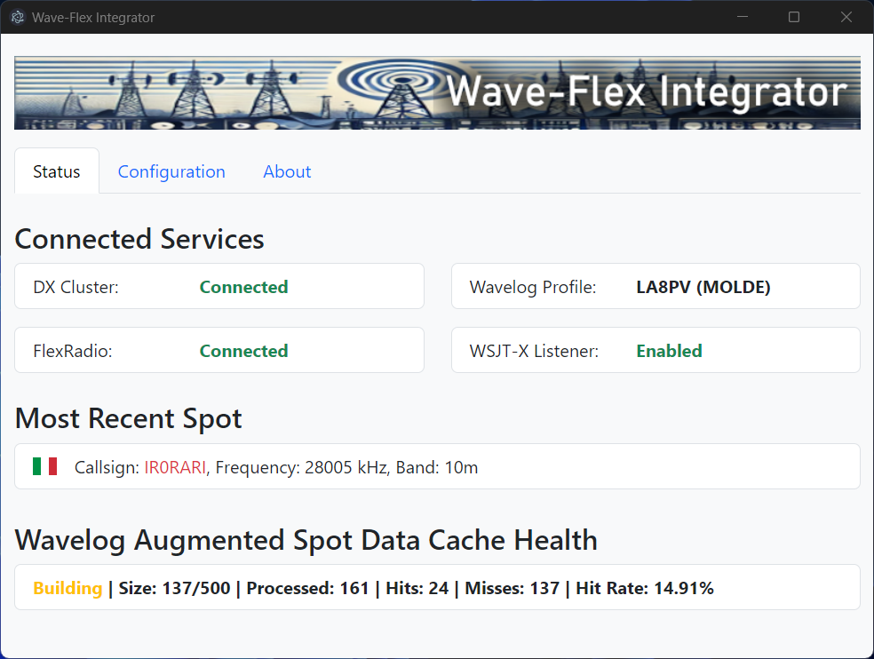
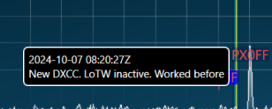

# Wave-Flex Integrator

[](LICENSE)
[](https://nodejs.org/)
[](#)

*A seamless bridge between your [FlexRadio](https://www.flexradio.com/) and [Wavelog](https://www.wavelog.org) logging software, integrating DX Cluster data, WSJT-X, QSO Assistant, and synchronizing frequency and mode, all without traditional CAT software.*



> **Note:** This software is currently in beta testing. Features and documentation may change as the project evolves.

---

## Table of Contents

- [Introduction](#introduction)
- [Key Features](#key-features)
- [What is Wave-Flex Integrator?](#what-is-wave-flex-integrator)
- [How it Works (The Event-Driven Advantage)](#how-it-works-the-event-driven-advantage)
  - [The Tri-Channel Architecture (How WFI talks to Wavelog)](#the-tri-channel-architecture-how-wfi-talks-to-wavelog)
- [What is Wavelog?](#what-is-wavelog)
  -[Try Wavelog Before You Commit](#try-wavelog-before-you-commit)
- [Requirements](#requirements)
  - [FlexRadio Compatibility](#flexradio-compatibility)
  - [SmartSDR Versions and Compatibility](#smartsdr-versions-and-compatibility)
- [Installation](#installation)
  - [Windows Installation](#windows-installation)
  - [Linux Installation](#linux-installation)
  - [macOS Installation](#macos-installation)
- [Auto-Updating](#auto-updating)
- [Configuration](#configuration)
  -[Configuration Parameters](#configuration-parameters)
  - [Linking Wavelog (Crucial Step for CAT Control)](#linking-wavelog-crucial-step-for-cat-control)
  -[SSL & HTTPS Support](#ssl--https-support)
- [Feature Details](#feature-details)
  -[CAT Listener (QSY Support)](#cat-listener-qsy-support)
  - [QSO Assistant](#qso-assistant)
  - [Profile Manager](#profile-manager)
  - [WSJT-X Integration](#wsjt-x-integration)
- [Usage](#usage)
  - [Security Warning on First Startup (Windows and macOS)](#security-warning-on-first-startup-windows-and-macos)
-[How DXCC Confirmation is Determined](#how-dxcc-confirmation-is-determined)
- [Debugging and Troubleshooting](#debugging-and-troubleshooting)
  - [Check that Wavelog can be reached on the About tab](#check-that-wavelog-can-be-reached-on-the-about-tab)
  -[Radio does not tune when clicking spots (CAT Failure)](#radio-does-not-tune-when-clicking-spots-cat-failure)
  - [Ensure No Other Applications Are Creating Spots on the SmartSDR panadapter](#ensure-no-other-applications-are-creating-spots-on-the-smartsdr-panadapter)
  - [Enable Debug Mode](#enable-debug-mode)
  - [Reproduce the Issue](#reproduce-the-issue)
  - [Locate the debug.log File](#locate-the-debuglog-file)
  - [Report an Issue](#report-an-issue)
  - [Additional Troubleshooting Tips](#additional-troubleshooting-tips)
- [Contributing](#contributing)
-[License](#license)
- [Acknowledgments](#acknowledgments)

---

## Introduction

**Wave-Flex Integrator** simplifies your ham radio setup by directly connecting your **FlexRadio** to the **Wavelog** web-based logging software. It integrates DX Cluster data, enhances spot information, enables "Click-to-Tune" from Wavelog, and provides a powerful QSO Assistant tool, all without the need for traditional CAT software.


When a spot appears on your SmartSDR panadapter, not only does it display important information through color-coding and opacity, but hovering your mouse pointer over the spot will also reveal a popup with detailed information about the station, including DXCC status, worked-before status, and LoTW membership. This provides an immediate, clear overview of each spot without having to rely solely on visual cues.



Additionally, the application provides a dedicated **QSO Assistant** window for quick lookups, rotor control, and media display (QRZ images/Maps).

> **Note:** The TNXQSO team is not affiliated with **Wavelog** or **FlexRadio**. This project is independently developed to integrate free of charge tools for the ham radio community. We exist only here on GitHub.

---

## Key Features

- **DX Cluster Integration**: Connects to a DX Cluster to receive real-time spot data.
- **CAT Listener (QSY Support)**: A local listener allows you to click spots in the Wavelog Bandmap to instantly tune your FlexRadio (replaces WavelogGate/FlRig).
- **QSO Assistant**: A dedicated, compact window for:
  - Callsign lookups (Wavelog & [QRZ.com](https://www.qrz.com)).
  - Profile images and Grid maps (OpenStreetMap).
  - Bearing/Distance calculation (Short & Long Path).
  - Rotator control (via MQTT).
- **Profile Manager**: View and load your FlexRadio Global Profiles via a simple grid interface, organized by Band and Mode.
- **Spot Augmentation**:
  - Enriches spot data using the Wavelog API.
  - Indicates whether a callsign's DXCC is needed for the band or mode.
  - Shows if the station is a **LoTW** (Logbook of The World) member.
- **WSJT-X Integration**:
  - Detects active QSOs and displays details of the current callsign being worked in Wavelog's live logging tab (fully configurable and optional).
  - Automatically logs completed QSOs from [WSJT-X](https://wsjt.sourceforge.io/wsjtx.html) ADIF broadcasts directly into Wavelog (fully configurable and optional).
- **Color-Coded Spots**:
  - Sends data enriched, color-coded spots to your FlexRadio, visible on your SmartSDR panadapter.
  - Customize colors and transparency based on DXCC status, worked-before status, and LoTW membership.
- **One-Click Logging**:
  - **SmartSDR for Windows**: Clicking a spot opens a pre-filled Wavelog logging window.
  - **SmartSDR for Mac/iOS**: Due to software limitations, this feature is not available.
- **Seamless Sync**: Automatically synchronizes frequency and mode between FlexRadio and Wavelog without CAT software.
- **Error Handling**: Reconnects automatically if the connection to the DX Cluster or FlexRadio drops.
- **Cross-Platform Support**: Aims to support Windows, macOS, and Linux.

---

## What is Wave-Flex Integrator?

Wave-Flex Integrator is a powerful tool designed to enhance your ham radio experience by bridging the gap between your FlexRadio and Wavelog logging software. By integrating DX Cluster data and enriching it with additional information via the Wavelog API, it provides you with real-time, actionable data directly on your SmartSDR panadapter.

---

## How it Works (The Event-Driven Advantage)

Traditional CAT software relies on **Polling** - a legacy method where the software constantly pesters the radio: *"What is your frequency? What is your mode?"*, often dozens of times per second.

On a network-native radio like FlexRadio, this approach is disastrous. It floods your network with redundant traffic, consumes radio CPU cycles, and introduces significant latency, especially when operating remotely via SmartLink. It makes a snappy radio feel sluggish.

**Let’s be honest: Why invest in a state-of-the-art SDR only to communicate with it using Stone Age protocols from the 1980s?**

Wave-Flex Integrator respects the hardware. Instead of asking, it **listens**. It establishes a direct TCP stream with the radio API. When you spin the VFO on your Maestro or changing the frequency or mode using SmartSDR, the radio *pushes* that event instantly to the application. The result is zero unnecessary network traffic, zero polling lag, and immediate synchronization.

### The Tri-Channel Architecture (How WFI talks to Wavelog)

To fully integrate with Wavelog's ecosystem, Wave-Flex Integrator acts as a universal translator, maintaining three distinct communication channels simultaneously. This is required because Wavelog separates its database, user interface, and hardware control into different protocols.

#### 1. The REST API (To SAVE & SYNC)
- **Direction:** Wave-Flex Integrator ➔ Wavelog Server (Database)
- **What it does:** This is the connection that updates the Wavelog server's "memory".
- **Why it's needed:** Without this connection, the server doesn't know what frequency your radio is actually tuned to. Even if your screen shows the correct frequency (thanks to the WebSocket), the server itself must "know" the frequency to accurately log the QSO into the database when you hit save. The API ensures that the server's reality perfectly matches the radio's reality.

#### 2. The WebSocket (To DISPLAY)
- **Direction:** Wave-Flex Integrator ➔ Your Web Browser (Screen)
- **What it does:** This is a high-speed "live stream" directly from your computer to your monitor.
- **Why it's needed:** The API (above) is too slow to keep up in real-time. To make the frequency numbers on your screen update smoothly and instantly without lag when you spin the VFO, this technology is required. It updates your *eyes*, but it does *not* save anything to the database.

#### 3. The HTTP CAT Listener (To CONTROL)
- **Direction:** Your Web Browser ➔ Wave-Flex Integrator ➔ FlexRadio
- **What it does:** It listens for commands from the Wavelog webpage to tune your radio. This is the channel working when you click a spot in the DX Cluster to change frequencies ("Click-to-Tune").
- **Why it's needed:** Wavelog's web interface is programmed to send a simple local web request (HTTP) when you click a spot. Wavelog cannot currently send tuning commands via the WebSocket. If the Integrator didn't listen on this channel (default port `54321`), clicking spots in the bandmap simply wouldn't work.

**Summary:**
If we only used a WebSocket, you would get a fast display on your screen, but you would lose the ability to click on spots, and there would be a high risk of the logbook losing track of what your Maestro or SmartSDR client is doing. Wave-Flex Integrator simply adapts to how Wavelog is built.

**Why this matters:**
For the **CAT Control** (clicking spots) to work, Wavelog needs to know where to send the commands. You must ensure the **Hardware Interface** in Wavelog points to the CAT Listener port.

---

## What is Wavelog?

[**Wavelog**](https://www.wavelog.org) is a free, web-based logging software for ham radio enthusiasts. Feature-rich and easy to set up, Wavelog can be hosted on your own server at no cost, or you can opt for affordable hosting services.

- **Install on Your Own Server**: Full control over your logging software with free setup.
- **Hosted Solutions**: Affordable services that handle server administration and updates.

### Try Wavelog Before You Commit

New to Wavelog? Explore its features on their demo page:

[**Wavelog Demo**](https://demo.wavelog.org/user/login)

The demo provides a hands-on experience to see if Wavelog suits your needs.

---

## Requirements

- **FlexRadio**: Compatible FlexRadio device (FLEX-6000-series) connected to your LAN or reachable over TCP/IP.
- **SmartSDR**: Installed and running on your local machine. Compatibility varies by version (see below). In the SmartSDR menu, make sure to set Settings --> Spots to `Enabled` and make sure you don't override Colors or Background.
- **Wavelog**: Installed and running (Version 1.8.6 or later).
- **DX Cluster Access**: A DX Cluster server accessible via Telnet. Find one [here](http://www.dxcluster.info/telnet/index.php).

### FlexRadio Compatibility

- **Supported Models**: All FlexRadio models that support TCP/IP communication.
- **Network Access**: The FlexRadio must be reachable from the machine running Wave-Flex Integrator.

### SmartSDR Versions and Compatibility

Wave-Flex Integrator communicates directly with the FlexRadio hardware API (TCP/IP), making it largely independent of the SmartSDR version used. However, certain interactive features depend on the capabilities of your SmartSDR client software:

- **SmartSDR for Windows** (Developed by FlexRadio Systems):
  - **Click-to-Log Feature**: Fully supported. Clicking a spot on the panadapter opens a pre-filled Wavelog logging window.

- **SmartSDR for Mac** (Developed by Marcus & Jan Roskosch):
  - **Click-to-Log Feature**: **Not supported**.
  - *Reason:* The Mac client does not send a notification back to the radio API when a spot is clicked. Therefore, Wave-Flex Integrator never receives the trigger signal. Please contact the developer of SmartSDR for Mac if you wish to request this feature.

- **SmartSDR for iOS** (Also by Marcus & Jan Roskosch):
  - **Click-to-Log Feature**: **Not supported** (Same limitation as the Mac version).

- **FlexRadio M-Series** (Radios with integrated touchscreens):
  - **Click-to-Log Feature**: **Not tested**. Functionality may vary.

> **Important Note:** While spots will *display* correctly on all platforms, the **one-click logging** feature is currently exclusive to **SmartSDR for Windows** due to API implementation differences in third-party clients.

---

## Installation

### Windows Installation

Wave-Flex Integrator binaries for Windows are available on the [GitHub Releases](https://github.com/tnxqso/wave-flex-integrator/releases) page.

1. **Download**: Get the latest Windows installer (`.exe` file) from the [Releases](https://github.com/tnxqso/wave-flex-integrator/releases) page.

2. **Install**: Run the installer and follow the on-screen instructions.

3. **Launch**: After installation, launch Wave-Flex Integrator from the Start Menu or Desktop shortcut.

### Linux Installation

Wave-Flex Integrator binaries for Linux are available on the [GitHub Releases](https://github.com/tnxqso/wave-flex-integrator/releases) page.

1. **Download**: Get the latest Linux package from the [Releases](https://github.com/tnxqso/wave-flex-integrator/releases) page.

2. **Install**: Use your distribution's package manager to install the application.

   For Debian-based distributions (Ubuntu, Debian):

   ```bash
   sudo dpkg -i wave-flex-integrator_1.0.0_amd64.deb
   ```

   For RPM-based distributions (Fedora, CentOS):

   ```bash
   sudo rpm -i wave-flex-integrator-1.0.0.x86_64.rpm
   ```

3. **Launch**: Start Wave-Flex Integrator from your applications menu or by running `wave-flex-integrator` from the terminal.

### macOS Installation

Wave-Flex Integrator binaries for macOS are available on the [GitHub Releases](https://github.com/tnxqso/wave-flex-integrator/releases) page.

1. **Download**: Get the latest macOS installer (`.dmg` file) from the [Releases](https://github.com/tnxqso/wave-flex-integrator/releases) page.

2. **Install**: Open the downloaded `.dmg` file and drag the Wave-Flex Integrator icon into your `Applications` folder.

3. **Launch**: After installation, you can launch Wave-Flex Integrator from the `Applications` folder or using Spotlight search.

---

## Auto-Updating

Wave-Flex Integrator includes an auto-update feature that automatically downloads and installs new versions as they become available. Simply restart the application to apply updates, no manual intervention is required.

---

## Configuration

Upon first startup, no services gets connected. This is normal. Configure the application via the **Configuration Tab**, save your settings, and restart the application.

### Configuration Parameters

#### Application General Settings

- **Theme**: Light, Dark, or System Sync.
- **Startup Tab**: Choose which tab opens by default.
- **QSO Assistant Settings**: 
  - **Show Profile Image & Map**: Toggle visual media in QSO Assistant.
  - **Auto-Log to Wavelog**: If enabled, lookups via Enter key or external triggers will automatically be logged.
- **Rotator Control**: Enable MQTT-based rotator control (e.g., RemoteQTH Interface V).
- **QRZ.com Integration**: Enable XML data lookup (requires QRZ subscription) to fetch names, locators, and images.

#### Wavelog Click-to-Tune (Local Listener)

- **Enable**: Turns on the local HTTP listener.
- **Bind IP**: Default `127.0.0.1`.
- **Port**: Default `54321`. This allows Wavelog to tune your radio.

#### DX Cluster Settings

- **Enabled**: Master switch to enable/disable DX Cluster connection.
- **Host**: The hostname or IP address of the DX Cluster server.
- **Port**: The port number for the server connection (typically 7300 or 7373).
- **Callsign**: Your amateur radio callsign (for logging in to DX Cluster only).
- **Login Prompt**: The prompt expected from the server for login, such as `login:`, `User:`, or `Login:`. The default is usually `login:`. Make sure the letter case and use of `:` are correct. You can verify the prompt using a Telnet client like [PuTTY](https://www.putty.org/) if connecting to a different server.
- **Commands After Login**: Optional commands to be executed after logging in. Provide a comma-separated list of commands. The default commands are recommended unless you need specific customizations. You should alter it to reflect your details though.
- **Reconnect Settings**: Configure the reconnection behavior if the connection is lost.

> **Tip:** Use a separate DX Cluster server for Wave-Flex Integrator to prevent conflicts with other applications. You can test connectivity using a Telnet client like [PuTTY](https://www.putty.org/).

#### FlexRadio Settings

- **Enabled**: Toggle FlexRadio integration.
- **Host**: FlexRadio's hostname or IP address.
- **Port**: Port number (default is 4992).
- **Spot Management**:
  - **Spot Age Limit**: Time after which spots are removed.
  - **Color Settings**: Customize spot colors based on criteria.

#### Wavelog Settings

- **BASE URL**: Your Wavelog API base URL (e.g., `https://YOURSERVER/index.php`). Typically, the ending part `/index.php` should be kept.
- **API Key**: Obtain from Wavelog under your account settings.
- **Station Location IDs**: Comma-separated IDs (optional).

#### WSJT-X Configuration

- **WSJT-X integration Enabled**: Toggle WSJT-X integration. If this is set to `false`, all WSJT-X functionality (including `Show QSO` and `Log QSO`) will be disabled, regardless of their individual settings.

- **UDP Listen Port**: The UDP port on which the application listens for WSJT-X “Network Messages” (default is `2237`). Configure WSJT-X **Settings → Reporting → UDP Server** to send to the integrator host/IP and this port.

- **Show ongoing WSJT-X QSO in Wavelog live logging**: When this option and `WSJT-X integration Enabled` are both set to `true`, the details of the ongoing QSO will be displayed in Wavelog's live logging tab (based on WSJT-X *Status* messages).

  While a logging window is opened in Wavelog for the purpose of displaying information about the callsign currently being worked, you are not required to manually complete the logging process in Wavelog.

  Although it is technically possible to manually log the QSO at this stage, it is not necessary, nor recommended. The actual logging will happen automatically if you have enabled the `Log WSJT-X QSO in Wavelog` option. This automatic logging is triggered when WSJT-X sends a *Logged ADIF* message at the end of the QSO.

- **Log WSJT-X QSO in Wavelog**: When both this option and `WSJT-X integration Enabled` are set to `true`, completed QSOs from WSJT-X broadcasts will be automatically logged in Wavelog (based on WSJT-X *Logged ADIF* messages). In WSJT-X settings (General tab), the station details for `My Call` and `My Grid` must match those set in Wavelog for the Station Location marked as `Active Station`. If the `Active Station` is changed in Wavelog, Wave-Flex Integrator should be restarted to pick up the changes.

- **Multicast / port sharing**: Multicast reception is **not supported** in the current version, and the integrator does not currently enable UDP port sharing. If you use multicast to feed multiple programs, use a UDP relay/fan-out feature in another application, or configure WSJT-X to send a unicast copy to the integrator.

> **Note:** Both **Show ongoing WSJT-X QSO in Wavelog live logging** and **Log WSJT-X QSO in Wavelog** options only take effect if WSJT-X integration (`WSJT-X integration Enabled`) is set to `true`. If WSJT-X integration is disabled, these features will not function, even if individually enabled.

### Linking Wavelog (Crucial Step for CAT Control)

When Wave-Flex Integrator connects to Wavelog, it registers the radio automatically. However, to enable the **CAT Control** features (clicking a spot in Wavelog to tune the radio), you might want to verify the Hardware Interface URL.

1.  Log in to **Wavelog**.
2.  Go to **Settings** -> **Hardware Interfaces** -> **Radios**.
3.  Look for a radio named **`wave-flex-integrator`**.
4.  Edit the radio and ensure the following settings are correct:
    *   **CAT URL:** Set this **EXACTLY** to:
        ```
        http://127.0.0.1:54321
        ```
        *(If Wave-Flex Integrator is running on a different computer, replace 127.0.0.1 with that computer's IP address).*
5.  Save changes.

### SSL & HTTPS Support

If your Wavelog is hosted on **HTTPS** (e.g., `https://mylog.com`), your browser might block connections to Wave-Flex Integrator (Localhost) due to "Mixed Content" security policies.

*   **The Fix:** Wave-Flex Integrator includes a built-in Certificate Manager.
*   Go to **Configuration** -> **HTTPS & Security**.
*   Click **"Install Local Certificate"**.
*   Restart your browser. Wave-Flex Integrator will now serve secure WebSockets (WSS) on port `54323`, allowing seamless connection with secure Wavelog sites.

---

## Feature Details

### CAT Listener (QSY Support)

This feature enables Wavelog to send QSY (Frequency Change) commands to your FlexRadio when you click on a spot in the DX Cluster or Bandmap. It effectively replaces external bridges like WavelogGate or FlRig.

1.  **Enable the Listener**: In Wave-Flex Integrator, go to **Configuration** -> **Local Listeners** and check "Enable Callback URL Listener".
2.  **Verify Wavelog**: Ensure the Hardware Interface URL in Wavelog matches the port shown in the application (Default: `54321`).
3.  **Activate in Wavelog**:
    *   Open the **DX Cluster** view in Wavelog.
    *   Locate the **"CAT Connection"** button (usually top left).
    *   **Click it so it turns GREEN.**
    *   *Note: If this button is red/off, Wavelog will not attempt to tune the radio when you click a spot.* Wavelog does not save this setting. You must enable this button every time you open or refresh the DX Cluster page.

### QSO Assistant

The **QSO Assistant** is a dedicated, compact floating window designed to sit alongside your logging workflow. It offers:

- **Unified Lookup**: Type a callsign and press Enter. The assistant fetches data from both Wavelog (previous QSOs) and QRZ.com (if enabled).
- **Stats Display**: Instantly see Name, QTH, Grid Square, and Bearings (Short Path & Long Path).
- **Media**: Displays the operator's profile picture (from QRZ) and a dynamic map of their location.
- **Visual Badges**: Color-coded badges indicate if you need this station for **DXCC**, **Slot** (Band/Mode), or if they use **LoTW** / **OQRS**.
- **Rotator Control**: If enabled, click the "ROTATE" or "LONG P" buttons to automatically turn your antenna to the calculated bearing using MQTT.
- **Flex Spot**: A dedicated button to send the looked-up callsign directly to your FlexRadio panadapter as a spot.

### Profile Manager

The **Profiles** tab lets you view and load **FlexRadio Global Profiles** directly from the application.

This tab depends on **profile name parsing** to classify profiles into a band/mode grid. To avoid missing profiles, follow the naming rules below.

---

#### What this tab does

- **Band grid layout:** Profiles are automatically sorted into columns by **band** (160M → 6M) for fast navigation.
- **Mode detection:** The app **guesses the mode from the profile name** (CW/SSB/DIGI/FM) and displays a color-coded, clickable button.
- **One-click load:** Clicking a button commands the radio to **load that Global Profile** immediately.

---

#### Critical requirement: profile names MUST contain BOTH band and mode

The application **does not read band/mode from the profile’s internal settings**.  
It classifies profiles using **only the profile name string**.

To be shown and placed correctly, the profile name must contain:

1. A supported **band token** (e.g., `20M`)
2. A supported **mode token** (e.g., `CW`, `USB`, `FT8`, etc.)

If either is missing, the profile cannot be reliably placed in the grid and may not appear.

---

#### Bands that are recognized

The app searches for one of these exact band strings:

`160M, 80M, 60M, 40M, 30M, 20M, 17M, 15M, 12M, 10M, 6M`

---

#### Modes that are recognized (detection rules)

The app uppercases the profile name and checks for these tokens:

- **CW**  
  Matches if the name includes: `CW`

- **DIGI** (displayed as **DIGU**)  
  Matches if the name includes any of: `DIG`, `FT8`, `RTTY`, `DATA`

- **SSB**  
  Matches if the name includes any of: `SSB`, `LSB`, `USB`, `PH`

- **FM**  
  Matches if the name includes: `FM`

##### Practical examples

- `20M FT8` → DIGI (button labeled **DIGU**)
- `40M USB` → SSB
- `80M PH` → SSB
- `15M CW` → CW
- `10M FM` → FM

---

#### Recommended naming convention

Use a consistent, simple format:

`<BAND> <MODE> - <OPTIONAL DETAILS>`

Examples that work:

- `20M CW`
- `40M LSB`
- `15M USB`
- `10M FT8 - Some more details`
- `60M USB`

---

## Usage

Start the application by launching it from the Start Menu (Windows), the Applications menu (Linux), or by opening the **Applications** folder and double-clicking on **Wave-Flex Integrator** (macOS). On macOS you can also use **Spotlight** by pressing `Command + Space`, typing "Wave-Flex Integrator," and pressing `Enter` to launch the app.

Wave-Flex Integrator will connect to your DX Cluster and FlexRadio, enhance spots, and synchronize with Wavelog.

> **Note:** After Wave-Flex Integrator has started up for the first time and the first spot has been augmented by Wavelog, you need to go into Wavelog and navigate to Account > Hardware Interfaces. Select the newly created wave-flex-integrator to become the default interface.

### Security Warning on First Startup (Windows and macOS)

When you launch Wave-Flex Integrator for the first time, you may encounter a security warning on both Windows and macOS. This is expected, and you can safely proceed.

#### Windows: "Unknown Publisher" Warning
On Windows, you may see a warning that the app is from an "Unknown Publisher." This occurs because the application hasn't been signed with a verified certificate yet.

To continue:

1. Click **More info**.
2. Then click **Run anyway** to proceed with the installation.

Rest assured, the software is safe to use. We are working towards acquiring a verified publisher certificate to avoid this warning in future releases.

#### macOS: "Unidentified Developer" Warning
On macOS, a similar warning may appear saying that the app is from an "Unidentified Developer."

To run the app:

1. Open **System Preferences** > **Security & Privacy** > **General**.
2. You'll see a message saying that Wave-Flex Integrator was blocked because it's not from an identified developer. Click **Open Anyway**.
3. Confirm your choice by clicking **Open** in the dialog that appears.

This step is necessary because the app hasn't yet been signed with an Apple Developer certificate. We recommend doing this only for trusted applications like Wave-Flex Integrator.

---

## How DXCC Confirmation is Determined

Wave-Flex Integrator seamlessly determines whether a DXCC entity is confirmed by querying your **Wavelog** installation. Wavelog, in turn, checks your configured QSL services to verify DXCC status. These settings can be found and adjusted in **Wavelog** under:

**Account** → **Default Values** → **Default QSL-Methods**

The QSL methods you have defined as default will dictate how DXCC confirmations are processed. For operators looking to apply for a **DXCC Award**, it's common to set **LoTW (Logbook of The World)** as the only QSL method, as LoTW is the official authority that grants DXCC awards. However, you can customize these methods based on your preferences and the types of confirmations you accept.

---

## Debugging and Troubleshooting

If you encounter issues, follow these steps to help diagnose and resolve them effectively.

### Check that Wavelog can be reached on the About tab

On the About tab, below the title **Wavelog Station Location** you should be able to see the `Station ID`, `Station Name`, `Station Grid Square` and `Station Callsign` fetched from the configured Wavelog server's `Active Station` in `Station Setup`. If there is no information you should check that your Wavelog server is up and running and that your configuration is correct. If you change the `Active Station` in Wavelog, you will need to restart the application to fetch the new values. The values you see here will be used by the application in various places.

### Radio does not tune when clicking spots (CAT Failure)
If the application is running but the radio doesn't react when you click a spot in Wavelog:

1.  **Check the "CAT Connection" Button:** Inside the Wavelog DX Cluster view, ensure the **CAT Connection** button is **GREEN**. If it is red, Wavelog is not sending any commands.
2.  **Verify the URL:** Go to **Hardware Interfaces** in Wavelog. If the URL is empty or incorrect, Wavelog doesn't know where to send the command. It must match your local listener (Default: `http://127.0.0.1:54321`).
3.  **Check Port Conflicts:** Ensure no other software (like **WaveLogGate**) is running and blocking port **54321**. Wave-Flex Integrator will usually warn you on startup if this port is busy.

### Ensure No Other Applications Are Creating Spots on the SmartSDR panadapter

Wave-Flex Integrator actively monitors and manages all spots displayed on the SmartSDR panadapter. To avoid conflicts or duplicate entries, make sure that no other applications are generating spots simultaneously. Additionally, only one instance of Wave-Flex Integrator should be connected to your FlexRadio at any given time to ensure operation and to avoid unexpected results.

### Enable Debug Mode

Run the application with debug logging:

- **Windows**: Launch the application from the command prompt with the `-- -- --debug` flag.

  ```bash
  "C:\Users\<YourUserName>\AppData\Local\Programs\wave-flex-integrator\WaveFlexIntegrator.exe" -- -- --debug
  ```

- **Linux**: Run from terminal with the `-- -- --debug` flag.

  ```bash
  wave-flex-integrator -- -- --debug
  ```

- **macOS**: Run from terminal with the -- -- --debug flag:

  ```bash
  /Applications/WaveFlexIntegrator.app/Contents/MacOS/WaveFlexIntegrator -- -- --debug
  ```

This creates a `debug.log` file with detailed logs.

### Reproduce the Issue

Use the application until the problem occurs to ensure relevant information is logged.

### Locate the debug.log File

- **Windows**:

  ```
  %LOCALAPPDATA%\wave-flex-integrator\logs\debug.log
  ```

- **Linux**:

  ```
  ~/.cache/wave-flex-integrator/logs/debug.log
  ```

- **macOS**:

  ```
  ~/Library/Logs/wave-flex-integrator/debug.log
  ```

### Report an Issue

If you cannot resolve the problem using the steps above, the best way to get help is to open a Bug Report on our GitHub repository. 

**Why use GitHub Issues?**
- **Community Visibility:** Other users might have the same problem and can "chime in" with their own observations or find a workaround.
- **Pattern Recognition:** It helps us see if a bug affects specific operating systems or setups.
- **Structured Tracking:** It allows us to track the bug from discovery to resolution in upcoming releases.

**How to report:**
1. Go to our [GitHub Issues page](https://github.com/tnxqso/wave-flex-integrator/issues).
2. Click **New Issue** and select **Bug report**.
3. Fill out the template with as much detail as possible.
4. **Attach your `debug.log` file** directly to the issue by dragging and dropping the file into the text box.

> **Note:** The `debug.log` file is overwritten each time you start a new debug session. Sensitive information (like passwords, tokens, and API keys) are automatically redacted `[REDACTED]` from the log to protect your privacy.

### Additional Troubleshooting Tips

- **Repeated Disconnects**:
  - Ensure you're not connected to the same DX Cluster from multiple applications.
  - Use different DX Cluster servers if needed.
- **Connection Issues**:
  - Test connectivity with Telnet or PuTTY.
  - Verify network settings and firewall configurations.

---

## Contributing

We welcome contributions from anyone with expertise in JavaScript, Node.js. If you're interested in improving Wave-Flex Integrator, feel free to open an issue or submit a pull request on GitHub.

Are you passionate about enhancing your FlexRadio experience? Consider joining our beta testing program or contributing directly to the project. Together, we can make this tool even better for the ham radio community!

---

## License

This project is licensed under the MIT License. See the [LICENSE](LICENSE) file for details.

---

## Acknowledgments

- [FlexRadio Systems](https://www.flexradio.com/)
- [Wavelog Logging Software](https://www.wavelog.org)
- [DX Cluster Networks](http://www.dxcluster.info/)
- [WSJT-X](https://wsjt.sourceforge.io/wsjtx.html)
- **Community Contributors**: Thanks to all who support and improve this project.

---

