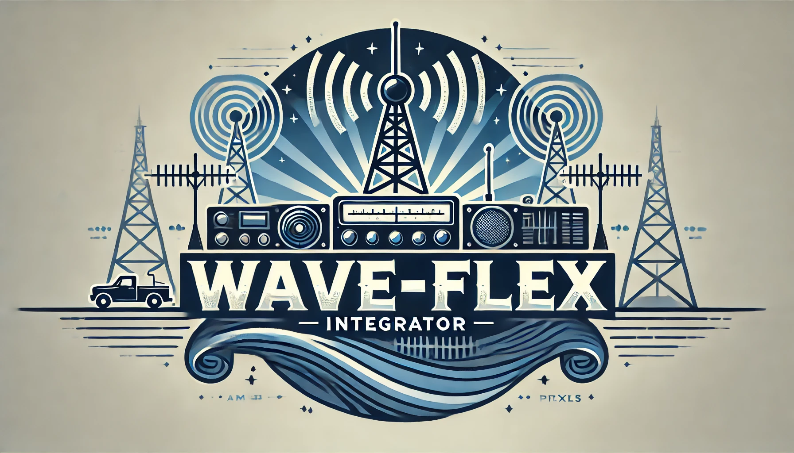
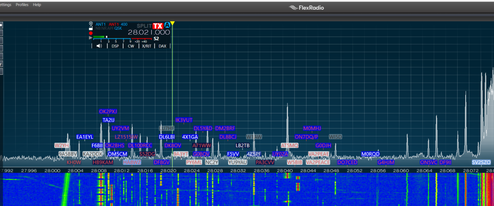

# Wave-Flex Integrator

[](LICENSE)
[](https://nodejs.org/)
[](#)

*A seamless bridge between your FlexRadio and Wavelog logging software, integrating DX Cluster data, and synchronizing frequency and mode, all without traditional CAT software.*



> **Note:** This software is currently in beta testing. Features and documentation may change as the project evolves.

---

## Table of Contents

- [Introduction](#introduction)
- [Features](#features)
- [What is Wave-Flex Integrator?](#what-is-wave-flex-integrator)
- [What is Wavelog?](#what-is-wavelog)
  - [Try Wavelog Before You Commit](#try-wavelog-before-you-commit)
- [Requirements](#requirements)
  - [FlexRadio Compatibility](#flexradio-compatibility)
  - [SmartSDR Versions and Compatibility](#smartsdr-versions-and-compatibility)
- [Installation](#installation)
  - [Prerequisites for Windows Installation](#prerequisites-for-windows-installation)
  - [Windows NPM Installation](#windows-npm-installation)
- [Configuration](#configuration)
  - [Configuration Parameters](#configuration-parameters)
- [Usage](#usage)
- [Debugging and Troubleshooting](#debugging-and-troubleshooting)
  - [Enable Debug Mode](#1-enable-debug-mode)
  - [Reproduce the Issue](#2-reproduce-the-issue)
  - [Locate the `debug.log` File](#3-locate-the-debuglog-file)
  - [Send the `debug.log` File](#4-send-the-debuglog-file)
  - [Additional Troubleshooting Tips](#5-additional-troubleshooting-tips)
- [Upgrading Wave-Flex Integrator](#upgrading-wave-flex-integrator)
- [Contributing](#contributing)
- [License](#license)
- [Acknowledgments](#acknowledgments)

---

## Introduction

Wave-Flex Integrator simplifies your ham radio setup by directly connecting your **FlexRadio** to the **Wavelog** web-based logging software. It integrates DX Cluster data, enhances spot information, and synchronizes your frequency and mode, all without the need for traditional CAT software.



When a spot appears on your SmartSDR panadapter, you can click it, and a pre-filled Wavelog logging window opens in your browser, ready to log the QSO. This seamless integration allows you to focus more on operating and less on managing multiple applications.

> **Note:** The TNXQSO team is not affiliated with **Wavelog** or **FlexRadio**. This project is independently developed to integrate free of charge tools for the ham radio community. We exist only here on GitHub.

---

## Features

- **DX Cluster Integration**: Connects to a DX Cluster to receive real-time spot data.
- **Spot Augmentation**:
  - Enriches spot data using the Wavelog API.
  - Indicates whether a callsign's DXCC is needed for the band or mode.
  - Shows if the station is a **LoTW** (Logbook of The World) member.
- **Color-Coded Spots**:
  - Sends data enriched, color-coded spots to your FlexRadio, visible on your SmartSDR panadapter.
  - Customize colors and transparency based on DXCC status, worked-before status, and LoTW membership.
- **One-Click Logging**:
  - **SmartSDR for Windows**: Clicking a spot opens a pre-filled Wavelog logging window.
  - **SmartSDR for Mac/iOS**: Due to software limitations, this feature is not available.
- **Seamless Sync**: Automatically synchronizes frequency and mode between FlexRadio and Wavelog without CAT software.
- **Error Handling**: Reconnects automatically if the connection to the DX Cluster or FlexRadio drops.
- **Cross-Platform Support**: Aims to support Windows, macOS, and Linux.

---

## What is Wave-Flex Integrator?

Wave-Flex Integrator is a powerful tool designed to enhance your ham radio experience by bridging the gap between your FlexRadio and Wavelog logging software. By integrating DX Cluster data and enriching it with additional information via the Wavelog API, it provides you with real-time, actionable data directly on your SmartSDR panadapter.

---

## What is Wavelog?

**Wavelog** is a free, web-based logging software for ham radio enthusiasts. Feature-rich and easy to set up, Wavelog can be hosted on your own server at no cost, or you can opt for affordable hosting services.

- **Install on Your Own Server**: Full control over your logging software with free setup.
- **Hosted Solutions**: Affordable services that handle server administration and updates.

### Try Wavelog Before You Commit

New to Wavelog? Explore its features on their demo page:

[**Wavelog Demo**](https://demo.wavelog.org/user/login)

The demo provides a hands-on experience to see if Wavelog suits your needs.

---

## Requirements

- **Node.js**: Version 12 or higher.
- **NPM**: Node Package Manager.
- **FlexRadio**: Compatible FlexRadio device (FLEX-6000-series) connected to your LAN or reachable over TCP/IP.
- **SmartSDR**: Installed and running on your local machine. Compatibility varies by version (see below).
- **Wavelog**: Installed and running (Version 1.8.6 or later).
- **DX Cluster Access**: A DX Cluster server accessible via Telnet.

### FlexRadio Compatibility

- **Supported Models**: All FlexRadio models that support TCP/IP communication.
- **Network Access**: The FlexRadio must be reachable from the machine running Wave-Flex Integrator.

### SmartSDR Versions and Compatibility

Wave-Flex Integrator communicates directly with the FlexRadio hardware, making it independent of the SmartSDR version used. However, some features depend on the capabilities of your SmartSDR software:

- **SmartSDR for Windows** (Developed by FlexRadio Systems):
  - [Download SmartSDR for Windows](https://www.flexradio.com/ssdr/)
  - **Click-to-Log Feature**: Fully supported. Clicking a spot opens a pre-filled Wavelog logging window.

- **SmartSDR for Mac** (Developed by Marcus & Jan Roskosch):
  - [SmartSDR for Mac](https://roskosch.de/smartsdr-for-mac/)
  - **Click-to-Log Feature**: **Not supported** due to software limitations. SmartSDR for Mac does not send information about clicked spots back to the FlexRadio, preventing Wave-Flex Integrator from triggering the logging action.

- **SmartSDR for iOS** (Also by Marcus & Jan Roskosch):
  - [SmartSDR for iOS](https://roskosch.de/smartsdr-features/)
  - **Click-to-Log Feature**: **Not tested**, but expected to have the same limitations as the Mac version.

- **FlexRadio M-Series** (Radios with integrated touchscreens):
  - **Click-to-Log Feature**: **Not tested**. Functionality may vary.

> **Important Note:** While the Wave-Flex Integrator is compatible with various versions of SmartSDR, the one-click logging feature is only available when using SmartSDR for Windows and probably also when using FlexRadio M-Series touch screen instead of SmartSDR.

---

## Installation

### Prerequisites for Windows Installation

Before installing, ensure you have the following:

- **Node.js**: Download and install the latest version from [nodejs.org](https://nodejs.org/).
- **NPM**: Comes bundled with Node.js. Verify with `npm -v`.
- **Git**: Install Git from [git-scm.com](https://git-scm.com/).

### Windows NPM Installation

Open Command Prompt and execute:

```bash
git clone https://github.com/tnxqso/wave-flex-integrator.git
cd wave-flex-integrator
npm install
npm start
```

> **Note:** Binaries for different platforms (Windows, macOS, Linux) and easier installation methods will be provided soon.

---

## Configuration

Upon first startup, ann error medsage will popup due to missing configuration. That is normal, configure the application via the **Configuration Tab**, save your settings and restart.

### Configuration Parameters

#### DX Cluster Settings

- **Host**: DX Cluster server hostname or IP address.
- **Port**: Port number (default is usually 7300 or 7373).
- **Callsign**: Your amateur radio callsign.
- **Login Prompt**: Custom login prompt format (optional).
- **Commands After Login**: Commands to execute after logging in (optional).
- **Reconnect Settings**: Configure reconnection behavior.

> **Tip:** Use a separate DX Cluster server for Wave-Flex Integrator to avoid conflicts with other applications. Test connectivity using a Telnet client like [PuTTY](https://www.putty.org/).

#### FlexRadio Settings

- **Enabled**: Toggle FlexRadio integration.
- **Host**: FlexRadio's hostname or IP address.
- **Port**: Port number (default is 4992).
- **Spot Management**:
  - **Spot Age Limit**: Time after which spots are removed.
  - **Color Settings**: Customize spot colors based on criteria.

#### Wavelog Settings

- **BASE URL**: Your Wavelog API base URL (e.g., `https://YOURSERVER/index.php`). Typically, the ending part `/index.php` should be kept.
- **API Key**: Obtain from Wavelog under your account settings.
- **Station Location IDs**: Comma-separated IDs (optional).

---

## Usage

Start the application:

```bash
npm start
```

Wave-Flex Integrator will begin connecting to your DX Cluster and FlexRadio, enhancing spots, and synchronizing with Wavelog.

---

## Debugging and Troubleshooting

If you encounter issues, follow these steps to help diagnose and resolve them effectively.

### 1. Enable Debug Mode

Run the application with debug logging:

```bash
npm start -- -- --debug
```

This creates a `debug.log` file with detailed logs.

### 2. Reproduce the Issue

Use the application until the problem occurs to ensure relevant information is logged.

### 3. Locate the `debug.log` File

- **Windows**:
  ```
  C:\Users\<YourUsername>\wave-flex-integrator\debug.log
  ```
- **macOS**:
  ```
  ~/wave-flex-integrator/debug.log
  ```
- **Linux**:
  ```
  ~/wave-flex-integrator/debug.log
  ```

### 4. Send the `debug.log` File

Email the `debug.log` file to us for analysis:

- **Email**: [ankeborg@duck.com](mailto:ankeborg@duck.com)
- **Subject**: Wave-Flex Integrator Debug Log
- **Attach**: The `debug.log` file
- **Include**: A brief description of the issue

> **Note:** The `debug.log` file is overwritten each time you start a new debug session.

### 5. Additional Troubleshooting Tips

- **Repeated Disconnects**:
  - Ensure you're not connected to the same DX Cluster from multiple applications.
  - Use different DX Cluster servers if needed.
- **Connection Issues**:
  - Test connectivity with Telnet or PuTTY.
  - Verify network settings and firewall configurations.

---

## Upgrading Wave-Flex Integrator

To update to the latest version:

```bash
cd wave-flex-integrator
git reset --hard
git pull origin main
npm install
npm start
```

---

## Contributing

We welcome contributions from anyone with expertise in JavaScript, Node.js. If you're interested in improving Wave-Flex Integrator, feel free to open an issue or submit a pull request on GitHub.

Are you passionate about enhancing your FlexRadio experience? Consider joining our beta testing program or contributing directly to the project. Together, we can make this tool even better for the ham radio community!

---

## License

This project is licensed under the MIT License. See the [LICENSE](LICENSE) file for details.

---

## Acknowledgments

- [FlexRadio Systems](https://www.flexradio.com/)
- [Wavelog Logging Software](https://www.wavelog.org)
- [DX Cluster Networks](http://www.dxcluster.info/)
- **Community Contributors**: Thanks to all who support and improve this project.

---
